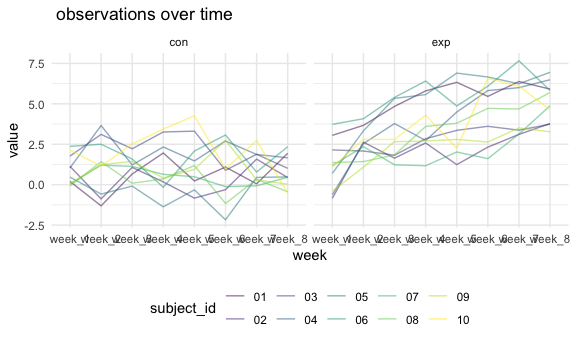

P8105\_HW5\_yz4188
================
Yueran Zhang
11/18/2021

``` r
library(tidyverse)
```

    ## ── Attaching packages ─────────────────────────────────────── tidyverse 1.3.1 ──

    ## ✓ ggplot2 3.3.5     ✓ purrr   0.3.4
    ## ✓ tibble  3.1.4     ✓ dplyr   1.0.7
    ## ✓ tidyr   1.1.3     ✓ stringr 1.4.0
    ## ✓ readr   2.0.1     ✓ forcats 0.5.1

    ## ── Conflicts ────────────────────────────────────────── tidyverse_conflicts() ──
    ## x dplyr::filter() masks stats::filter()
    ## x dplyr::lag()    masks stats::lag()

``` r
library(patchwork)
```

``` r
knitr::opts_chunk$set(
  fig.width = 6,
  fig.asp = .6,
  out.width = "90%"
)

theme_set(theme_minimal() + theme(legend.position = "bottom"))

options(
  ggplot2.continuous.colour = "viridis",
  ggplot2.continuous.fill = "viridis"
)

scale_colour_discrete = scale_colour_viridis_d
scale_fill_discrete = scale_fill_viridis_d
```

\#Problem 1

``` r
homicide_df = 
  read_csv('homicide-data.csv', na = c("", 'Unknown')) %>%
  mutate(
    city_state = str_c(city, state),
    resolution = case_when(
      disposition == "Closed without arrest" ~ "unsolved",
      disposition == "Open/No arrest" ~ "unsolved",
      disposition == "Closed by arrest" ~ "solved",
    )) %>% 
  
  relocate(city_state) %>%
  filter(city_state != "TulsaAL")
```

    ## Rows: 52179 Columns: 12

    ## ── Column specification ────────────────────────────────────────────────────────
    ## Delimiter: ","
    ## chr (8): uid, victim_last, victim_first, victim_race, victim_sex, city, stat...
    ## dbl (4): reported_date, victim_age, lat, lon

    ## 
    ## ℹ Use `spec()` to retrieve the full column specification for this data.
    ## ℹ Specify the column types or set `show_col_types = FALSE` to quiet this message.

About Baltimore, MD.

``` r
baltimore_df = 
  homicide_df %>% 
  filter(city_state == "BaltimoreMD")

baltimore_summary = 
  baltimore_df %>% 
  summarize(
    unsolved = sum(resolution ==  "unsolved"),
    n = n()
)

baltimore_test = 
prop.test(
  x = baltimore_summary %>% pull(unsolved),
  n = baltimore_summary %>% pull(n))

baltimore_test %>%
  broom::tidy()
```

    ## # A tibble: 1 × 8
    ##   estimate statistic  p.value parameter conf.low conf.high method    alternative
    ##      <dbl>     <dbl>    <dbl>     <int>    <dbl>     <dbl> <chr>     <chr>      
    ## 1    0.646      239. 6.46e-54         1    0.628     0.663 1-sample… two.sided

Iterate across cities.

``` r
  prop_test_function = function(city_df){
    
    city_summary = 
      city_df %>% 
      summarize(
        unsolved = sum(resolution ==  "unsolved"),
        n = n()
)

    city_test = 
    prop.test(
      x = city_summary %>% pull(unsolved),
      n = city_summary %>% pull(n))
    
    return(city_test)
  }

prop_test_function(baltimore_df)
```

    ## 
    ##  1-sample proportions test with continuity correction
    ## 
    ## data:  city_summary %>% pull(unsolved) out of city_summary %>% pull(n), null probability 0.5
    ## X-squared = 239.01, df = 1, p-value < 2.2e-16
    ## alternative hypothesis: true p is not equal to 0.5
    ## 95 percent confidence interval:
    ##  0.6275625 0.6631599
    ## sample estimates:
    ##         p 
    ## 0.6455607

``` r
homicide_df %>% 
  filter(city_state == "AlbuquerqueNM") %>% 
prop_test_function()
```

    ## 
    ##  1-sample proportions test with continuity correction
    ## 
    ## data:  city_summary %>% pull(unsolved) out of city_summary %>% pull(n), null probability 0.5
    ## X-squared = 19.114, df = 1, p-value = 1.232e-05
    ## alternative hypothesis: true p is not equal to 0.5
    ## 95 percent confidence interval:
    ##  0.3372604 0.4375766
    ## sample estimates:
    ##         p 
    ## 0.3862434

Iterate all cities!

``` r
results_df =
  homicide_df %>% 
  nest(data = uid:resolution) %>% 
  mutate(
    test_results = map(data,prop_test_function),
    tidy_results = map(test_results, broom::tidy)
  ) %>% 
  select(city_state,tidy_results) %>% 
  unnest(tidy_results) %>% 
  select(city_state, estimate,starts_with("conf"))
```

Plot with estimates and CI.

``` r
results_df %>%
  mutate(city_state = fct_reorder(city_state,estimate)) %>% 
  ggplot(aes(x = city_state,y = estimate)) +
  geom_point() +
  geom_errorbar(aes(ymin = conf.low, ymax = conf.high)) +
  theme(axis.text.x = element_text(angle = 90, vjust = 0.5, hjust = 1))
```


``` r
homicide_df %>%
  group_by(city_state) %>%
  summarize(
    unsolved = sum(resolution == "unsolved"),
    total = n()
  ) %>%
  mutate(
    test_results = map2(unsolved,total,prop.test),
    tidy_results = map(test_results,broom::tidy)
  ) %>% 
  select(city_state,tidy_results) %>% 
  unnest(tidy_results) %>% 
  select(city_state, estimate,starts_with("conf"))
```

    ## # A tibble: 50 × 4
    ##    city_state    estimate conf.low conf.high
    ##    <chr>            <dbl>    <dbl>     <dbl>
    ##  1 AlbuquerqueNM    0.386    0.337     0.438
    ##  2 AtlantaGA        0.383    0.353     0.415
    ##  3 BaltimoreMD      0.646    0.628     0.663
    ##  4 Baton RougeLA    0.462    0.414     0.511
    ##  5 BirminghamAL     0.434    0.399     0.469
    ##  6 BostonMA         0.505    0.465     0.545
    ##  7 BuffaloNY        0.612    0.569     0.654
    ##  8 CharlotteNC      0.300    0.266     0.336
    ##  9 ChicagoIL        0.736    0.724     0.747
    ## 10 CincinnatiOH     0.445    0.408     0.483
    ## # … with 40 more rows

## Problem 2

``` r
files = list.files("HW5-data",full.names = TRUE)
path_df = 
  tibble(map(files,read.csv)) %>%
  janitor::clean_names() %>%
  unnest() %>%
  mutate(path = files) %>%
  separate(path, into = c("dir","file_name"), sep = "/") %>%
  separate(file_name, into = c("control_arm","subject_id"), sep = "_") %>%
  separate(subject_id, into = c("subject_id","postfix"), sep = ".csv") %>%
  select(-dir,-postfix) %>% 
pivot_longer(
    week_1:week_8,
    names_to = "week", 
    values_to = "value") %>% 

ggplot(aes(x = week, y = value, color = subject_id, group = subject_id)) +
  labs(title = " observations over time") + geom_line(alpha = 0.5) +
  facet_grid(. ~ control_arm) 
```

    ## Warning: `cols` is now required when using unnest().
    ## Please use `cols = c(map_files_read_csv)`

``` r
path_df
```


From the plot，we know that as the time increases, there is no
significant difference of between the increasing observed value for the
experiment arm and the control arm.

## Problem 3

``` r
library(tidyverse)

set.seed(10)

iris_with_missing = iris %>% 
  map_df(~replace(.x, sample(1:150, 20), NA)) %>%
  mutate(Species = as.character(Species))
```

``` r
missing_value = function(x){
  if (is.numeric(x)) {
    x = replace_na(x, mean(x, na.rm = TRUE))
  }else if (is.character(x)){
    x = replace_na(x, "virginica")
  }
}

Full_Data = map(iris_with_missing,missing_value) %>% 
as_tibble()

Full_Data
```

    ## # A tibble: 150 × 5
    ##    Sepal.Length Sepal.Width Petal.Length Petal.Width Species
    ##           <dbl>       <dbl>        <dbl>       <dbl> <chr>  
    ##  1         5.1          3.5         1.4         0.2  setosa 
    ##  2         4.9          3           1.4         0.2  setosa 
    ##  3         4.7          3.2         1.3         0.2  setosa 
    ##  4         4.6          3.1         1.5         1.19 setosa 
    ##  5         5            3.6         1.4         0.2  setosa 
    ##  6         5.4          3.9         1.7         0.4  setosa 
    ##  7         5.82         3.4         1.4         0.3  setosa 
    ##  8         5            3.4         1.5         0.2  setosa 
    ##  9         4.4          2.9         1.4         0.2  setosa 
    ## 10         4.9          3.1         3.77        0.1  setosa 
    ## # … with 140 more rows
